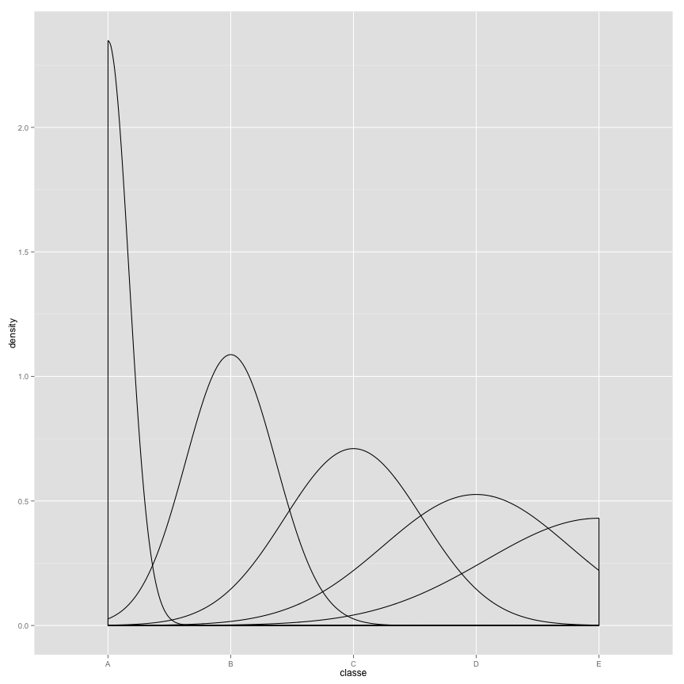

# Machine Learning - Predicting Exercise Behavior
### Author: Himanshu Rawat
### Date: 16th July, 2015

- [Objective](#objective)
- [Collecting Data](#collecting-data)
- [Exploring and Preparing Data](#exploring-and-preparing-data)
- [Training Model on the Data](#training-model-on-the-data)
- [Tunning and Optimising the Model](#tunning-and-optimising-the-model)
- [Evaluating Model Performance](#evaluating-model-performance)
- [Apply Machine Learning Algorithm](#apply-machine-learning-algorithm)
- [Appendix](#appendix)

******************


## Objective

Using devices such as Jawbone Up, Nike FuelBand, and Fitbit it is now possible to collect a large amount of data about personal activity relatively inexpensively. These type of devices are part of the quantified self movement – a group of enthusiasts who take measurements about themselves regularly to improve their health, to find patterns in their behavior, or because they are tech geeks. One thing that people regularly do is quantify how much of a particular activity they do, but they rarely quantify how well they do it.

The goal of project is to predict the manner in which they did the exercise. It's `classe` variable in the training set.

classe  | Explanation
------- | ------------
A       | Specified execution of the exercise
B       | Throwing elbows to the front
C       | Lifting the dumbbell only halfway
D       | Lowering the dumbbell only halfway
E       | Throwing the hips to the front

We will build a training model on the data and finally applying machine learning algorithm to the test data set.

## Collecting Data

Download [Training](https://d396qusza40orc.cloudfront.net/predmachlearn/pml-training.csv) and [Test](https://d396qusza40orc.cloudfront.net/predmachlearn/pml-testing.csv) data sets.


## Exploring and Preparing Data

```r
har.raw <- read.csv(file = "pml-training.csv" , na.strings = c("", "NA") , stringsAsFactors = FALSE)
```
We have `159` predictors and `1` outcome (`classe`) variables. Due to the lack of subject matter knowledge, I need to eliminate obsolete and choose most relevant and influential predictors.

Simple strategy is to select only those columns having < 50 percent (`NA`|`empty`) values.

```r
har.raw <- har.raw[, colSums(is.na(har.raw)) < nrow(har.raw) * 0.5]
```
Now we have 60 columns. Again peeking into the data set, first seven columns can be removed intuitively.

```r
str(har.raw[,1:7])
```

```
## 'data.frame':	19622 obs. of  7 variables:
##  $ X                   : int  1 2 3 4 5 6 7 8 9 10 ...
##  $ user_name           : chr  "carlitos" "carlitos" "carlitos" "carlitos" ...
##  $ raw_timestamp_part_1: int  1323084231 1323084231 1323084231 1323084232 1323084232 1323084232 1323084232 1323084232 1323084232 1323084232 ...
##  $ raw_timestamp_part_2: int  788290 808298 820366 120339 196328 304277 368296 440390 484323 484434 ...
##  $ cvtd_timestamp      : chr  "05/12/2011 11:23" "05/12/2011 11:23" "05/12/2011 11:23" "05/12/2011 11:23" ...
##  $ new_window          : chr  "no" "no" "no" "no" ...
##  $ num_window          : int  11 11 11 12 12 12 12 12 12 12 ...
```

```r
har.raw <- har.raw[,8:60]
```
And, finally convert outcome variable (`classe`) to factors.

```r
har.raw$classe <- as.factor(har.raw$classe)
```
To evaluate the performance of our training model, we need another data for validation. Lets partition the training data set.

```r
har.rows <- createDataPartition(har.raw$classe, p = 0.75, list = FALSE)
har.train <- har.raw[har.rows,]
har.validate <- har.raw[-har.rows,]
data.frame(har.raw = dim(har.raw), har.train = dim(har.train), har.validate = dim(har.validate), row.names = c("rows", "columns"))
```

```
##         har.raw har.train har.validate
## rows      19622     14718         4904
## columns      53        53           53
```


Density plot of `classe` variable shows class `A` is right skewed and class `B,C,D,E` almost following a standard normal distribution. 

[Appendix - Classe Distribution](#classe-distribution)

## Training Model on the Data

We will use `C5.0` algorithm for training our decision tree model. Lets begin with simple model and see its performance by applying on validation data set.

```r
har.test.model <- C5.0(classe ~ ., data = har.train, method = "C5.0")
temp.predict <- predict(har.test.model,har.validate)
```
Statistics from `confusion matrix`

```r
cm <- confusionMatrix(temp.predict,har.validate$classe, dnn = c("Actual Classe", "Predicted Classe"))
cm
```

```
## Confusion Matrix and Statistics
## 
##              Predicted Classe
## Actual Classe    A    B    C    D    E
##             A 1371   10    5    3    3
##             B   16  900   20   12    3
##             C    3   20  804   24    6
##             D    1   13   23  759    9
##             E    4    6    3    6  880
## 
## Overall Statistics
##                                           
##                Accuracy : 0.9613          
##                  95% CI : (0.9555, 0.9665)
##     No Information Rate : 0.2845          
##     P-Value [Acc > NIR] : <2e-16          
##                                           
##                   Kappa : 0.951           
##  Mcnemar's Test P-Value : 0.8407          
## 
## Statistics by Class:
## 
##                      Class: A Class: B Class: C Class: D Class: E
## Sensitivity            0.9828   0.9484   0.9404   0.9440   0.9767
## Specificity            0.9940   0.9871   0.9869   0.9888   0.9953
## Pos Pred Value         0.9849   0.9464   0.9382   0.9429   0.9789
## Neg Pred Value         0.9932   0.9876   0.9874   0.9890   0.9948
## Prevalence             0.2845   0.1935   0.1743   0.1639   0.1837
## Detection Rate         0.2796   0.1835   0.1639   0.1548   0.1794
## Detection Prevalence   0.2838   0.1939   0.1748   0.1642   0.1833
## Balanced Accuracy      0.9884   0.9677   0.9636   0.9664   0.9860
```
Resulting in an : 

1. Accuracy of 96.13 percent.
2. Error rate of 3.87 percent.

Our measurement of model performance i.e. `kappa` statistic is 95.1.

Overall, model performance is good but there is always room for improvement.

## Tunning and Optimising the Model

Next, we will tune our model and improve accuracy of decision tree with adaptive boosting. Here our goal is to optimise our model using `caret` package.

By setting the seed parameter (in this case to the arbitrary number 123), the random 
numbers will follow a predefined sequence. This allows simulations like train(), which use random sampling, to be repeated with identical results.

```r
set.seed(123)
```
Create a set of configuration options known as a control object. These options allow for the management of model evaluation criteria such as the resampling strategy and the measure used for choosing the best model.

Here our resampling strategy is `k-fold cross-validation` and `oneSE` to select the optimal model among the various candidates.

```r
ctrl <- trainControl(method = "cv", number = 10, selectionFunction = "oneSE")
```
Create a grid of parameters to optimize. The grid must include a column for each parameter in the desired model, prefixed by a period.

```r
grid <- expand.grid(.model = "tree", .trials = c(1, 5, 10, 15, 20, 25, 30, 35),
                    .winnow = "FALSE")
```
`Kappa` indicates the statistic to be used by the model evaluation function `oneSE`.

```r
har.model <- train(classe ~ ., data = har.train, method = "C5.0",
                   metric = "Kappa", trControl = ctrl, tuneGrid = grid)
```

```
## Warning in Ops.factor(x$winnow): '!' not meaningful for factors
```

```r
print(har.model)
```

```
## C5.0 
## 
## 14718 samples
##    52 predictor
##     5 classes: 'A', 'B', 'C', 'D', 'E' 
## 
## No pre-processing
## Resampling: Cross-Validated (10 fold) 
## 
## Summary of sample sizes: 13246, 13247, 13244, 13245, 13246, 13245, ... 
## 
## Resampling results across tuning parameters:
## 
##   trials  Accuracy   Kappa      Accuracy SD  Kappa SD   
##    1      0.9597788  0.9491246  0.005206316  0.006574242
##    5      0.9849840  0.9810045  0.002747973  0.003476433
##   10      0.9908952  0.9884830  0.001732000  0.002191080
##   15      0.9927301  0.9908041  0.001725314  0.002182297
##   20      0.9942248  0.9926951  0.001761884  0.002228781
##   25      0.9944964  0.9930385  0.002012222  0.002545494
##   30      0.9944282  0.9929522  0.002372347  0.003001007
##   35      0.9945643  0.9931243  0.002076655  0.002627108
## 
## Tuning parameter 'model' was held constant at a value of tree
## 
## Tuning parameter 'winnow' was held constant at a value of FALSE
## Kappa was used to select the optimal model using  the one SE rule.
## The final values used for the model were trials = 20, model = tree
##  and winnow = FALSE.
```
## Evaluating Model Performance

`Kappa` statistic adjusts accuracy by accounting for the possibility of a correct prediction by chance alone.

1. 1 = Indicates perfect agreement between the model's predictions and the true values, rarely happens.
2. < 1 = Indicates imperfect agreement. Closer the value to 1, better the performance.

Now that we have trained and tuned our model, lets evaluate this improved model on our validation data set.

```r
har.predict <- predict(har.model,har.validate)
cm <- confusionMatrix(har.predict,har.validate$classe, dnn = c("Actual Classe", "Predicted Classe"))
cm
```

```
## Confusion Matrix and Statistics
## 
##              Predicted Classe
## Actual Classe    A    B    C    D    E
##             A 1395    2    0    0    0
##             B    0  943    2    0    1
##             C    0    3  849    2    1
##             D    0    1    4  800    2
##             E    0    0    0    2  897
## 
## Overall Statistics
##                                           
##                Accuracy : 0.9959          
##                  95% CI : (0.9937, 0.9975)
##     No Information Rate : 0.2845          
##     P-Value [Acc > NIR] : < 2.2e-16       
##                                           
##                   Kappa : 0.9948          
##  Mcnemar's Test P-Value : NA              
## 
## Statistics by Class:
## 
##                      Class: A Class: B Class: C Class: D Class: E
## Sensitivity            1.0000   0.9937   0.9930   0.9950   0.9956
## Specificity            0.9994   0.9992   0.9985   0.9983   0.9995
## Pos Pred Value         0.9986   0.9968   0.9930   0.9913   0.9978
## Neg Pred Value         1.0000   0.9985   0.9985   0.9990   0.9990
## Prevalence             0.2845   0.1935   0.1743   0.1639   0.1837
## Detection Rate         0.2845   0.1923   0.1731   0.1631   0.1829
## Detection Prevalence   0.2849   0.1929   0.1743   0.1646   0.1833
## Balanced Accuracy      0.9997   0.9965   0.9958   0.9967   0.9975
```
Resulting in an : 

1. Accuracy of 99.59 percent.
2. Error rate of 0.41 percent.

Our measurement of model performance i.e. `kappa` statistic is 99.48.

And there was room for improvement. Great!!

## Apply Machine Learning Algorithm

Now we can apply this model which have trained and tuned to real test data set to predict the `classe` for each observation.

```r
har.test <- read.csv(file = "pml-testing.csv" , na.strings = c("", "NA") , stringsAsFactors = FALSE)
har.test <- har.test[, colSums(is.na(har.test)) < nrow(har.test) * 0.5]
har.test <- har.test[,8:60]
predicted.outcome <- predict(har.model,har.test)
final.predictions <- data.frame(problem_id = har.test$problem_id, classe = predicted.outcome)
```
Our predictions :

```r
final.predictions
```

```
##    problem_id classe
## 1           1      B
## 2           2      A
## 3           3      B
## 4           4      A
## 5           5      A
## 6           6      E
## 7           7      D
## 8           8      B
## 9           9      A
## 10         10      A
## 11         11      B
## 12         12      C
## 13         13      B
## 14         14      A
## 15         15      E
## 16         16      E
## 17         17      A
## 18         18      B
## 19         19      B
## 20         20      B
```
Store the final predictions

```r
write.table(final.predictions,file="exercise_predictions.txt", row.names = FALSE)
```

## Appendix

### Classe Distribution
 

*********************
