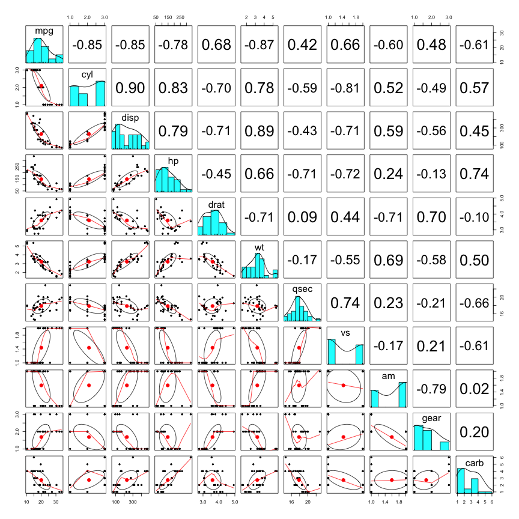
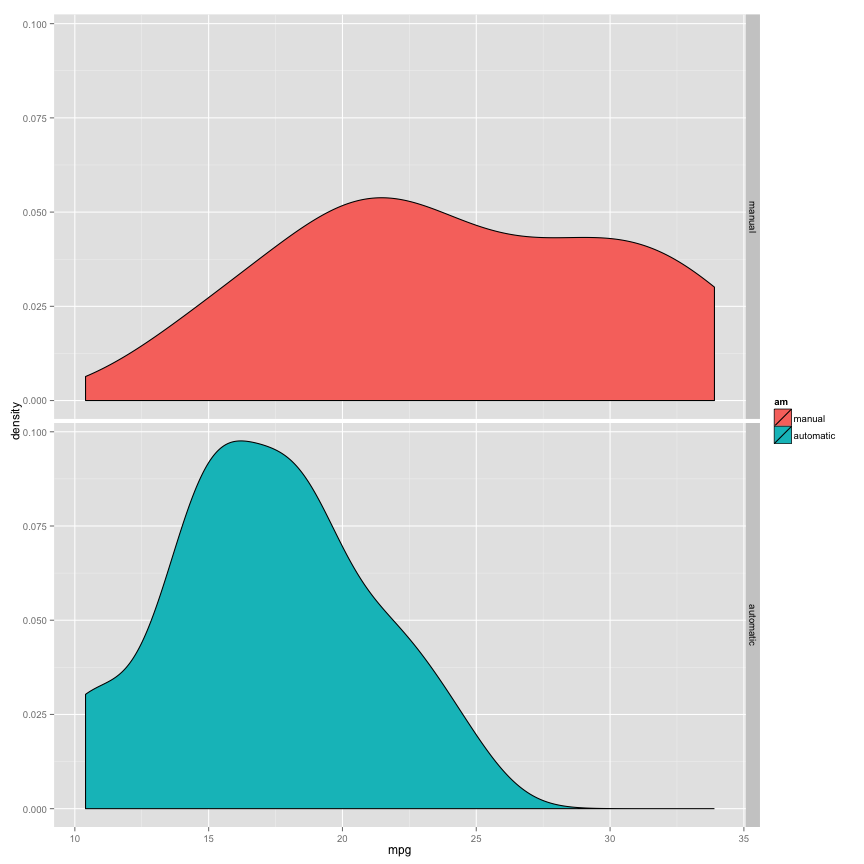
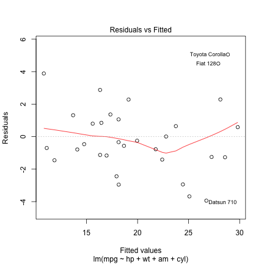
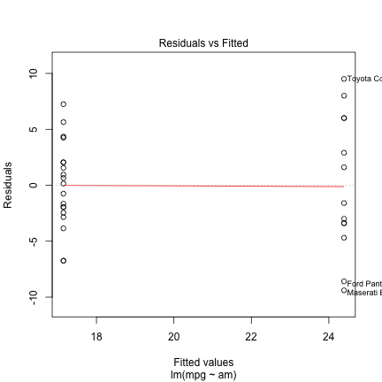
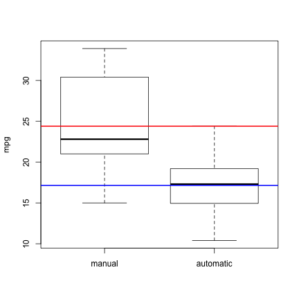

# Motor Trend - Exploring relationship between MPG and Others
### Author: Himanshu Rawat
### Date: 9th July, 2015

- [Executive Summary](#executive-summary)
- [Data Processing](#data-processing)
- [Exploratory Data Analyses](#exploratory-data-analyses)
- [Statistical Inference](#statistical-inference)
- [Applying Regression](#applying-regression)
- [Residual Plot](#residual-plot)
- [Appendix](#appendix)

******************


## Executive Summary

<span style="color:red;">`Motor Trend`</span>, a magazine about the automobile industry is interested in exploring the relationship between a set of variables and miles per gallon (MPG) (outcome). They are particularly interested in the following two questions:

1. Is an automatic or manual transmission better for MPG.
2. Quantify the MPG difference between automatic and manual transmissions.

Data set used to answer above questions is <span style="color:red;">`mtcars`</span>. It comprises of fuel consumption and 10 aspects of automobile design and performance for 32 automobiles.

After the analysis, we concluded that 

1. Maunal transmission is better for MPG.
2. Major features that effect MPG are `cyl, wt, hp` while `am` least.
3. When considering the relevant features that affects MPG, we found that manual transmission gives 1.8 more MPG than automatic. 

## Data Processing
As dataset is part of default R installation, all we need to load it.


```r
data(mtcars)
str(mtcars)
```

```
## 'data.frame':	32 obs. of  11 variables:
##  $ mpg : num  21 21 22.8 21.4 18.7 18.1 14.3 24.4 22.8 19.2 ...
##  $ cyl : num  6 6 4 6 8 6 8 4 4 6 ...
##  $ disp: num  160 160 108 258 360 ...
##  $ hp  : num  110 110 93 110 175 105 245 62 95 123 ...
##  $ drat: num  3.9 3.9 3.85 3.08 3.15 2.76 3.21 3.69 3.92 3.92 ...
##  $ wt  : num  2.62 2.88 2.32 3.21 3.44 ...
##  $ qsec: num  16.5 17 18.6 19.4 17 ...
##  $ vs  : num  0 0 1 1 0 1 0 1 1 1 ...
##  $ am  : num  1 1 1 0 0 0 0 0 0 0 ...
##  $ gear: num  4 4 4 3 3 3 3 4 4 4 ...
##  $ carb: num  4 4 1 1 2 1 4 2 2 4 ...
```
Our primary interest is in transmission feature (`am`) which we must convert to factors. With that, we can also convert (`cyl, vs, gear, carb`) to factors.

```r
mtcars$am <- factor(mtcars$am, levels = c("1", "0"), labels = c("manual","automatic"))

to.factors <- c("cyl", "vs", "gear", "carb")
mtcars[,to.factors] <- lapply(mtcars[,to.factors], as.factor)

str(mtcars)
```

```
## 'data.frame':	32 obs. of  11 variables:
##  $ mpg : num  21 21 22.8 21.4 18.7 18.1 14.3 24.4 22.8 19.2 ...
##  $ cyl : Factor w/ 3 levels "4","6","8": 2 2 1 2 3 2 3 1 1 2 ...
##  $ disp: num  160 160 108 258 360 ...
##  $ hp  : num  110 110 93 110 175 105 245 62 95 123 ...
##  $ drat: num  3.9 3.9 3.85 3.08 3.15 2.76 3.21 3.69 3.92 3.92 ...
##  $ wt  : num  2.62 2.88 2.32 3.21 3.44 ...
##  $ qsec: num  16.5 17 18.6 19.4 17 ...
##  $ vs  : Factor w/ 2 levels "0","1": 1 1 2 2 1 2 1 2 2 2 ...
##  $ am  : Factor w/ 2 levels "manual","automatic": 1 1 1 2 2 2 2 2 2 2 ...
##  $ gear: Factor w/ 3 levels "3","4","5": 2 2 2 1 1 1 1 2 2 2 ...
##  $ carb: Factor w/ 6 levels "1","2","3","4",..: 4 4 1 1 2 1 4 2 2 4 ...
```

## Exploratory Data Analyses

Since dependent variable is `mpg`, let see how it is distributed.

```r
summary(mtcars$mpg)
```

```
##    Min. 1st Qu.  Median    Mean 3rd Qu.    Max. 
##   10.40   15.42   19.20   20.09   22.80   33.90
```
We can see the median and mean are close to each other, we can assume its normal distribution. Also `mpg` [ScatterPlot Matrix](#scatter-plot-matrix) depicts same. Linear regression assumes a normal distribution for the dependent variable. 

Seeing a normal distribution tells us that we can use the mean and median interchangeably, and it also tells we can trust that most of the time you won't see data more than three standard deviations away from the mean.

### Visualizing relationships among features via [ScatterPlot Matrix](#scatter-plot-matrix). 

It tells a lot of things as below:

1. Above the diagonal, the scatterplots have been replaced with a correlation matrix. We can see strong correlation among many variables like 

  * `mpg & (cyl,disp)` has strong negative correlation (`-0.85`).
  * `mpg & am` has negative correlation (`-0.60`). Interested variable for this case.
  * `cyl & disp` has max positive correlation (`0.90`).

2. Down the diagonal, the correlation between the two variables is indicated by the shape of the ellipse; the more it is stretched, the stronger the correlation.

3. The curve drawn on the scatterplot is called a loess smooth. The loess smooth of `mpg and am` is an increasing upward line from 2 to 1. Again we can say that `manual transmission` has more fuel consumption than `automatic`.

[Appendix - Scatter Plot Matrix](#scatter-plot-matrix)

### [Density Plot](#density-plot) of automatic and manual transmission for fuel consumption. 

The resulting plot makes it seem reasonable to believe that manual transmission tends to have better miles per gallon than automatic transmission.

[Appendix - Density Plot](#density-plot)

## Statistical Inference

We begin visualizing the data by plotting a [boxplot](#box-plot).

It reveals that the mean mpg of automatic transmission cars is lower than the average mpg of manual transmission vehicles.

`t test` is best for problems associated with an inference based on small samples. Also it helps us to determine whether there is a difference between two independent datasets.

Here, we need to examine `mpg` for `automatic` and `manual` transmission. In simpler terms, lets assume they do not affect `mpg` i.e. we made a `null hypothesis`. 

We need to conduct a `t test` (independent) to accept or reject our hypthoesis.

```r
test <- t.test(mpg ~ am,data = mtcars)
test
```

```
## 
## 	Welch Two Sample t-test
## 
## data:  mpg by am
## t = 3.7671, df = 18.332, p-value = 0.001374
## alternative hypothesis: true difference in means is not equal to 0
## 95 percent confidence interval:
##   3.209684 11.280194
## sample estimates:
##    mean in group manual mean in group automatic 
##                24.39231                17.14737
```
P-value 0.0013736 < than 0.05 (standard value to be considered) and thus P-value will be considered significant i.e. We have to reject our hypothesis ~ transmission type does affect `mpg`.

[Appendix - Box Plot](#box-plot)

## Applying Regression

### 1st Model (Single variable)

Lets fit `linear regression` model to the data as our primary interest is in `am`.

```r
car.begin.model <- lm(formula = mpg ~ am, data = mtcars)
```
### Interpreting estimated beta coefficients

```r
summary(car.begin.model)
```

```
## 
## Call:
## lm(formula = mpg ~ am, data = mtcars)
## 
## Residuals:
##     Min      1Q  Median      3Q     Max 
## -9.3923 -3.0923 -0.2974  3.2439  9.5077 
## 
## Coefficients:
##             Estimate Std. Error t value Pr(>|t|)    
## (Intercept)   24.392      1.360  17.941  < 2e-16 ***
## amautomatic   -7.245      1.764  -4.106 0.000285 ***
## ---
## Signif. codes:  0 '***' 0.001 '**' 0.01 '*' 0.05 '.' 0.1 ' ' 1
## 
## Residual standard error: 4.902 on 30 degrees of freedom
## Multiple R-squared:  0.3598,	Adjusted R-squared:  0.3385 
## F-statistic: 16.86 on 1 and 30 DF,  p-value: 0.000285
```
The estimated beta coefficients indicate the increase in `mpg` for an increase of one in each of the features when the other features are held constant.

1. Automatic transmission (`amautomatic`) tends to give `-7.245` times less `mpg` than Manual transmission.

2. `(***)` indicate the predictive power of each feature in the model. `amautomatic` is statistically significant feature in this model.

3. The Multiple R-squared value provides a measure of how well our model as a whole explains the values of the dependent variable. Since the R-squared value is 0.3598, only 35 percent of the variation in the dependent variable is explained by our model.

Clear indication that we need to imporve our model (`unacceptable R-squared value`).

### 2nd Model (Multiple Variables)

We need to include more features in our model. First row in [Scatter Plot Matrix](#scatter-plot-matrix) gives us the correlation values between `mpg` and other independant variables. We will consider `cyl, disp, hp, wt` and `am` in our improved model.

1. `hp & wt` makes sense as more horsepower and weight (an enemy of fuel economy); less miles per gallon.
2. `cyl (4,6,8)`; more number of cylinders, less miles per gallon
3. `disp`; generally larger displacement consumes more fuel resulting in less miles per gallon.


```r
new.model <- lm(formula = mpg ~ hp + wt + am + cyl + disp, data = mtcars)
summary(new.model)
```

```
## 
## Call:
## lm(formula = mpg ~ hp + wt + am + cyl + disp, data = mtcars)
## 
## Residuals:
##     Min      1Q  Median      3Q     Max 
## -3.9374 -1.3347 -0.3903  1.1910  5.0757 
## 
## Coefficients:
##              Estimate Std. Error t value Pr(>|t|)    
## (Intercept) 35.670376   2.122096  16.809  3.9e-15 ***
## hp          -0.032480   0.013983  -2.323   0.0286 *  
## wt          -2.738695   1.175978  -2.329   0.0282 *  
## amautomatic -1.806099   1.421079  -1.271   0.2155    
## cyl6        -3.136067   1.469090  -2.135   0.0428 *  
## cyl8        -2.717781   2.898149  -0.938   0.3573    
## disp         0.004088   0.012767   0.320   0.7515    
## ---
## Signif. codes:  0 '***' 0.001 '**' 0.01 '*' 0.05 '.' 0.1 ' ' 1
## 
## Residual standard error: 2.453 on 25 degrees of freedom
## Multiple R-squared:  0.8664,	Adjusted R-squared:  0.8344 
## F-statistic: 27.03 on 6 and 25 DF,  p-value: 8.861e-10
```
This model explains 83 percent variation and as per belief (3) `disp` is statistically insignificant i.e. not contributing to model. We can omit it as it may be affecting the model.

```r
new.model <- lm(formula = mpg ~ hp + wt + am + cyl, data = mtcars)
summary(new.model)
```

```
## 
## Call:
## lm(formula = mpg ~ hp + wt + am + cyl, data = mtcars)
## 
## Residuals:
##     Min      1Q  Median      3Q     Max 
## -3.9387 -1.2560 -0.4013  1.1253  5.0513 
## 
## Coefficients:
##             Estimate Std. Error t value Pr(>|t|)    
## (Intercept) 35.51754    2.03171  17.482 6.81e-16 ***
## hp          -0.03211    0.01369  -2.345  0.02693 *  
## wt          -2.49683    0.88559  -2.819  0.00908 ** 
## amautomatic -1.80921    1.39630  -1.296  0.20646    
## cyl6        -3.03134    1.40728  -2.154  0.04068 *  
## cyl8        -2.16368    2.28425  -0.947  0.35225    
## ---
## Signif. codes:  0 '***' 0.001 '**' 0.01 '*' 0.05 '.' 0.1 ' ' 1
## 
## Residual standard error: 2.41 on 26 degrees of freedom
## Multiple R-squared:  0.8659,	Adjusted R-squared:  0.8401 
## F-statistic: 33.57 on 5 and 26 DF,  p-value: 1.506e-10
```
Now, our model can explain 84 percent variation in miles per gallon. `wt` has become more statistically significant. 

1. Each unit of `wt` increase is associated with decrease of `2.49683` `mpg`.
2. Each unit of `hp` increase is associated with decrease of `0.03211` `mpg`.
3. Motor vehicles having 6 cylinder `cyl6` gives `3.03134` less `mpg` than 4 cylinder vehicles.
4. Though `am` is statistically insignificant, automatic transmission gives `1.80921` less `mpg` than manual transmission.

## Residual Plot

We need to check this plot in order to validate the model. Model is fit if it shows random pattern else not. 

We need to have randomness and unpredictability in a valid model. In other words, none of the explanatory/predictive information should be in the error.

Linear regression with single variable residual plot shows non random pattern. This model is not capturing some explanatory variables. Make sense as we only have one variable.

This can be considered as invalid model and can be improved.

[Appendix - Single Variable Residual Plot](#single-variable-residual-plot)

Linear regression with multivariable plot shows random pattern. Plot is well scattered. 

This can be considered as a valid model but there is always room for more improvement.

[Appendix - Multivariable Residual Plot](#multivariable-residual-plot)

## Appendix

### Scatter Plot Matrix

 

### Density Plot

 

### Multivariable Residual Plot

 

### Single Variable Residual Plot
 

### Box Plot
 

*********************


