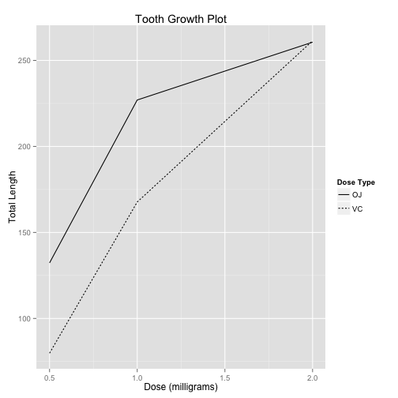

# Exponential Distribution - Analyzing ToothGrowth Dataset
### Author: Himanshu Rawat
### Date: 14Jun 2015

- [Overview](#overview)
- [Load the ToothGrowth data and perform some basic exploratory data analyses](#load-the-toothGrowth-data-and-perform-some-basic-exploratory-data-analyses)
- [Provide a basic summary of the data](#provide-a-basic-summary-of-the-data)
- [Use confidence intervals and/or hypothesis tests to compare tooth growth by supp and dose](#use-confidence-intervals-and-/-or-hypothesis-tests-to-compare-tooth-growth-by-supp-and-dose)
- [State your conclusions and the assumptions needed for your conclusions](#state-your-conclusions-and-the-assumptions-needed-for-your-conclusions)

***********

## Overview

We need to analyze `ToothGrowth` Dataset that comes with R package. `ToothGrowth` dataset contatins **the effect of Vitamin C on the Tooth Growth in Guinea Pigs.

The response is the length of odontoblasts (teeth) in each of 10 guinea pigs at each of three dose levels of Vitamin C (0.5, 1, and 2 mg) with each of two delivery methods (orange juice or ascorbic acid).

## Load the ToothGrowth data and perform some basic exploratory data analyses

Below scripts loads the dataset and peek into it.


```r
library(datasets)
data(ToothGrowth)
summary(ToothGrowth)
```

```
##       len        supp         dose      
##  Min.   : 4.20   OJ:30   Min.   :0.500  
##  1st Qu.:13.07   VC:30   1st Qu.:0.500  
##  Median :19.25           Median :1.000  
##  Mean   :18.81           Mean   :1.167  
##  3rd Qu.:25.27           3rd Qu.:2.000  
##  Max.   :33.90           Max.   :2.000
```

```r
str(ToothGrowth)
```

```
## 'data.frame':	60 obs. of  3 variables:
##  $ len : num  4.2 11.5 7.3 5.8 6.4 10 11.2 11.2 5.2 7 ...
##  $ supp: Factor w/ 2 levels "OJ","VC": 2 2 2 2 2 2 2 2 2 2 ...
##  $ dose: num  0.5 0.5 0.5 0.5 0.5 0.5 0.5 0.5 0.5 0.5 ...
```
Some basic exploratory data analyses.

```r
library(ggplot2,warn.conflicts = FALSE, verbose = FALSE)
# Total length of tooth by each levels of vitamin doses(0.5,1,2) for each supplement type
tooth.len.data <- aggregate(ToothGrowth$len ~ ToothGrowth$supp + ToothGrowth$dose, data = ToothGrowth, sum)
colnames(tooth.len.data) <- c("supplement_type", "dose", "length_total")

plot <- qplot(tooth.len.data$dose, tooth.len.data$length_total, data=tooth.len.data, geom ="line", linetype=tooth.len.data$supplement_type)
plot <- plot + ggtitle("Tooth Growth Plot")
plot <- plot + xlab("Dose (milligrams)") + ylab("Total Length")
plot <- plot + labs(linetype = "Dose Type")
plot
```

 

Information from graph :

* For higher values of dosages (2.0 mg) for both dose types (OJ,VC), tooth length is almost equal.
* For lower values of dosages (1.0 mg), dose type (OJ) has more tooth length than dose type (VC).
* As dosage values increases, tooth length are increasing for both dose types.

## Provide a basic summary of the data

We are reporting the mean and standard deviation.

```r
tooth.mean.data <- aggregate(ToothGrowth$len ~ ToothGrowth$supp + ToothGrowth$dose, data = ToothGrowth, mean)
colnames(tooth.mean.data) <- c("supplement_type", "dose", "average")

tooth.sd.data <- aggregate(ToothGrowth$len ~ ToothGrowth$supp + ToothGrowth$dose, data = ToothGrowth, sd)
colnames(tooth.sd.data) <- c("supplement_type", "dose", "sd")

tooth.mean.data
```

```
##   supplement_type dose average
## 1              OJ  0.5   13.23
## 2              VC  0.5    7.98
## 3              OJ  1.0   22.70
## 4              VC  1.0   16.77
## 5              OJ  2.0   26.06
## 6              VC  2.0   26.14
```

```r
tooth.sd.data
```

```
##   supplement_type dose       sd
## 1              OJ  0.5 4.459709
## 2              VC  0.5 2.746634
## 3              OJ  1.0 3.910953
## 4              VC  1.0 2.515309
## 5              OJ  2.0 2.655058
## 6              VC  2.0 4.797731
```

## Use confidence intervals and/or hypothesis tests to compare tooth growth by supp and dose. (Only use the techniques from class, even if there's other approaches worth considering)

We will be using `t test` for the comparisons. 

Null hypothesis says 

* Population means are equal.
* Two groups are from the sample population.

Normally, we want to reject the Null hypothesis and support the alternative hypothesis. 

Often we assume 5 % p-value as the boundary to assume we have evidence to reject the null hypothesis. 

* If p <= 5 %, sufficient evidence of difference and reject null hypothesis
* If p > 5 %, not sufficient evidence of difference and accept null hypothesis.

### Whether different supplement types(OJ and VC) results in equal length of tooth growth?

* Null hypothesis : OJ and VC results in equal tooth lengths.
* Alternative hypothesis: OJ and VC results in unequal tooth lengths.


```r
print(supp.test <- t.test(len ~ supp, data = ToothGrowth))
```

```
## 
## 	Welch Two Sample t-test
## 
## data:  len by supp
## t = 1.9153, df = 55.309, p-value = 0.06063
## alternative hypothesis: true difference in means is not equal to 0
## 95 percent confidence interval:
##  -0.1710156  7.5710156
## sample estimates:
## mean in group OJ mean in group VC 
##         20.66333         16.96333
```

We can see that `p-value` from out test is 6.0634508 %. That means probability of the sampling data we sampled given that there is no difference in lengths in the two supplement types is 6.0634508 %. 

Interpretation: 

* Different supplements types results in equal tooth lengths.

### Whether different supplement types having dose quantities (0.5,1.0,2.0) results in equal length of tooth?

* Null hypothesis : Different dosage quantites results in equal tooth lengths.
* Alternative hypothesis: Different dosage quantites results in unequal tooth lengths.


```r
print(dose0.5 <- t.test(len ~ supp, data = ToothGrowth[ToothGrowth$dose == 0.5, ]))
```

```
## 
## 	Welch Two Sample t-test
## 
## data:  len by supp
## t = 3.1697, df = 14.969, p-value = 0.006359
## alternative hypothesis: true difference in means is not equal to 0
## 95 percent confidence interval:
##  1.719057 8.780943
## sample estimates:
## mean in group OJ mean in group VC 
##            13.23             7.98
```

```r
print(dose1.0 <- t.test(len ~ supp, data = ToothGrowth[ToothGrowth$dose == 1.0, ]))
```

```
## 
## 	Welch Two Sample t-test
## 
## data:  len by supp
## t = 4.0328, df = 15.358, p-value = 0.001038
## alternative hypothesis: true difference in means is not equal to 0
## 95 percent confidence interval:
##  2.802148 9.057852
## sample estimates:
## mean in group OJ mean in group VC 
##            22.70            16.77
```

```r
print(dose2.0 <- t.test(len ~ supp, data = ToothGrowth[ToothGrowth$dose == 2.0, ]))
```

```
## 
## 	Welch Two Sample t-test
## 
## data:  len by supp
## t = -0.0461, df = 14.04, p-value = 0.9639
## alternative hypothesis: true difference in means is not equal to 0
## 95 percent confidence interval:
##  -3.79807  3.63807
## sample estimates:
## mean in group OJ mean in group VC 
##            26.06            26.14
```
Dose (mg)   |   p-value (%)
----------  |   ----------
0.5         |   0.6358607
1.0         |   0.1038376
2.0         |   96.3851589

p-values for (0.5 and 1.0) dosages are < 5 %.
p-values for (2.0) dosages are > 5 %.

Interpretation:

* Dose quantites (0.5 and 1.0) for both supplement results in different tooth lengths.
* Dose quantity (2.0) for both supplement results in equal tooth lengths.

**Our plot graph also depicts the same results.**

## State your conclusions and the assumptions needed for your conclusions

### Conclusions

* Both supplement types results in equal tooth lengths when dose quantities are not considered.
* Increased dose quantities for both supplement types results in increase in tooth length i.e. difference becomes smaller.
* Supplement type (OJ) has more tooth length than (OJ) with lower dose quantites.
* Dose quantity (2.0) for both supplements do not have different tooth lengths.

### Assumptions

* Variance is estimated separately for groups.
* Data is not paired.
* Guniea Pigs are measured only once for every measurment parameters. 
* Sample population is not too big.

