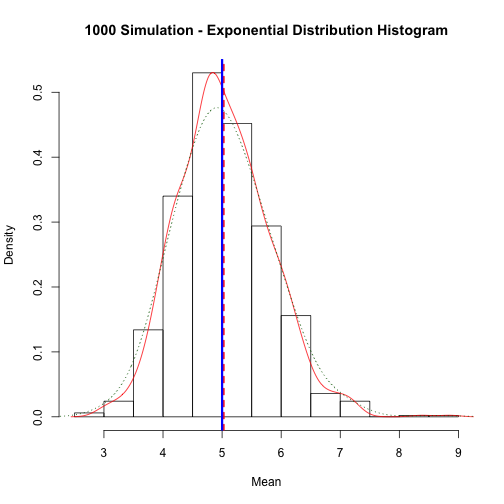
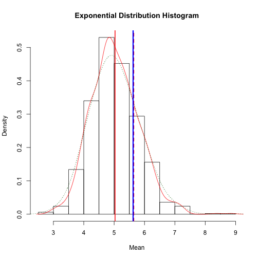
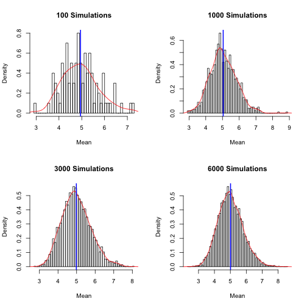

# Exponential Distribution - Statistical Inference
### Author: Himanshu Rawat
### Date: 13Jun 2015

- [Overview](#overview)
- [Sample mean and its comparison it to the theoretical mean of the distribution](#sample-mean-and-its-comparison-it-to-the-theoretical-mean-of-the-distribution)
- [Show how variable the sample is (via variance) and compare it to the theoretical variance of the distribution](#show-how-variable-the-sample-is-via-variance-and-compare-it-to-the-theoretical-variance-of-the-distribution)
- [Show that the distribution is approximately normal](#show-that-the-distribution-is-approximately-normal)

***********

## Overview

This is the project for the statistical inference class. We will use simulation to explore inference and do some simple inferential data analysis.

We will nvestigate the exponential distribution in R and compare it with the Central Limit Theorem. The exponential distribution can be simulated in R with <span style="color:red;">`rexp(n, lambda)`</span> where **lambda** is the **rate parameter**. 

* Theoretical mean of exponential distribution is <span style="color:red;">`1/lambda`</span>.
* Theoretical standard deviation is <span style="color:red;">`1/lambda`</span>.

**lambda = 0.2 for all of the simulations**

## Sample mean and its comparison it to the theoretical mean of the distribution

Sample code for the 1000 simulations of the averages of 40 exponentials. Rate parameter is **lambda**.

```r
set.seed(2000)
exp.dist <- NULL
exp.num <- 40
simulation.count <- 1000
rate <- 0.2

for (i in 1 : simulation.count)
{
    exp.dist = c(exp.dist, mean(rexp(exp.num,rate)))
}
```
Sample Mean :

```r
cal.m <- round(mean(exp.dist),2)
cal.m
```

```
## [1] 5.03
```
Theoretical Mean :

```r
theo.m <- 1/0.2
theo.m
```

```
## [1] 5
```
### Means Comparison

Sample Mean |   Theoretical Mean
----------  |   ----------------
5.03   |       5


```r
hist(exp.dist, prob = TRUE, xlab = "Mean", ylab = "Density", main = "1000 Simulation - Exponential Distribution Histogram")
lines(density(exp.dist),col = "red")
lines(density(exp.dist, adjust=2), lty="dotted", col = "darkgreen")
abline(v= cal.m, col = "red", lty = 2, lwd = 2)
abline(v = theo.m, col = "blue", lwd = 3)
```

 

Above graphs show both means and they are almost overlapping each other

**Note** 

* sample mean         = Vertical dotted red line.
* theoretical mean    = Vertical solid blue line.

**Interpretation** : Distribution of the mean of 40 exponentials is centered at 5.03 which is close to the theoretical value of 5. Hence it can be considered as a good approximation of the theoretical mean.

## Show how variable the sample is (via variance) and compare it to the theoretical variance of the distribution

Variance depicts the numerical measure of how the data values is dispersed around the mean.  

Sample Variance:

```r
cal.v <- round(var(exp.dist),3)
cal.v
```

```
## [1] 0.617
```
Theoretical Variance:

```r
st.dev <- 1/0.2 #lambda = 0.2
theo.v <- ((1/0.2)/sqrt(40)) ^ 2 # population variance 
theo.v
```

```
## [1] 0.625
```
### Variance Comparsion

Sample Variance     |   Theoretical Variance
----------          |   ----------------
0.617           |       0.625


```r
hist(exp.dist, prob = TRUE, xlab = "Mean", ylab = "Density", main = "Exponential Distribution Histogram")
lines(density(exp.dist),col = "red")
lines(density(exp.dist, adjust=2), lty="dotted", col = "darkgreen")
abline(v= cal.m, col = "red", lty = 1, lwd = 2)
abline(v= cal.m + cal.v, col = "red", lty = 2, lwd = 2)
abline(v = theo.m + theo.v, col = "blue", lwd = 3)
```

 

**Note** 

* sample mean               = Veticle solid red line.
* sample variance           = Vertical dotted red line.
* theoretical variance      = Vertical solid blue line.

**Interpretation** : Hardly any differences between the variances. Data will also be closely dispersed from the mean.

## Show that the distribution is approximately normal

To achieve this, we need to run different simulations of counts (100,1000,3000,6000). CLT says that as the sample size increases the distribution becomes that of standard normal.


```r
set.seed(2000)

exp.dist.100 <- NULL
exp.dist.1000 <- NULL
exp.dist.3000 <- NULL
exp.dist.6000 <- NULL
for (i in 1 : 100) exp.dist.100 = c(exp.dist.100, mean(rexp(40,rate)))
for (i in 1 : 1000) exp.dist.1000 = c(exp.dist.1000, mean(rexp(40,rate)))
for (i in 1 : 3000) exp.dist.3000 = c(exp.dist.3000, mean(rexp(40,rate)))
for (i in 1 : 6000) exp.dist.6000 = c(exp.dist.6000, mean(rexp(40,rate)))

par(mfrow = c(2, 2))
# begin plots
hist(exp.dist.100, prob = TRUE,breaks=50, xlab = "Mean", ylab = "Density", main = "100 Simulations")
lines(density(exp.dist.100),col = "red")
abline(v = mean(exp.dist.100), col = "blue", lwd = 2)

hist(exp.dist.1000, prob = TRUE, breaks=50,xlab = "Mean", ylab = "Density", main = "1000 Simulations")
lines(density(exp.dist.1000),col = "red")
abline(v = mean(exp.dist.1000), col = "blue", lwd = 2)

hist(exp.dist.3000, prob = TRUE,breaks=50,xlab = "Mean", ylab = "Density", main = "3000 Simulations")
lines(density(exp.dist.3000),col = "red")
abline(v = mean(exp.dist.3000), col = "blue", lwd = 2)

hist(exp.dist.6000, prob = TRUE, breaks=50,xlab = "Mean", ylab = "Density", main = "6000 Simulations")
lines(density(exp.dist.6000),col = "red")
abline(v = mean(exp.dist.6000), col = "blue", lwd = 2)
```

 

We can see that in **Plot - 6000 Simulations** as sample size increased, distribution converges to standard normal (Bell Curve) as compared to **Plot - 100 Simulations**.

***********
